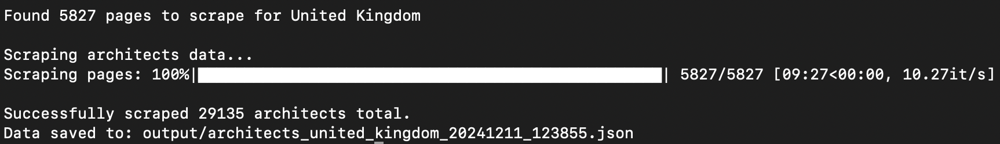
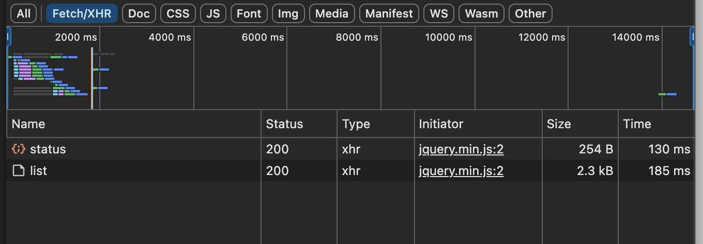
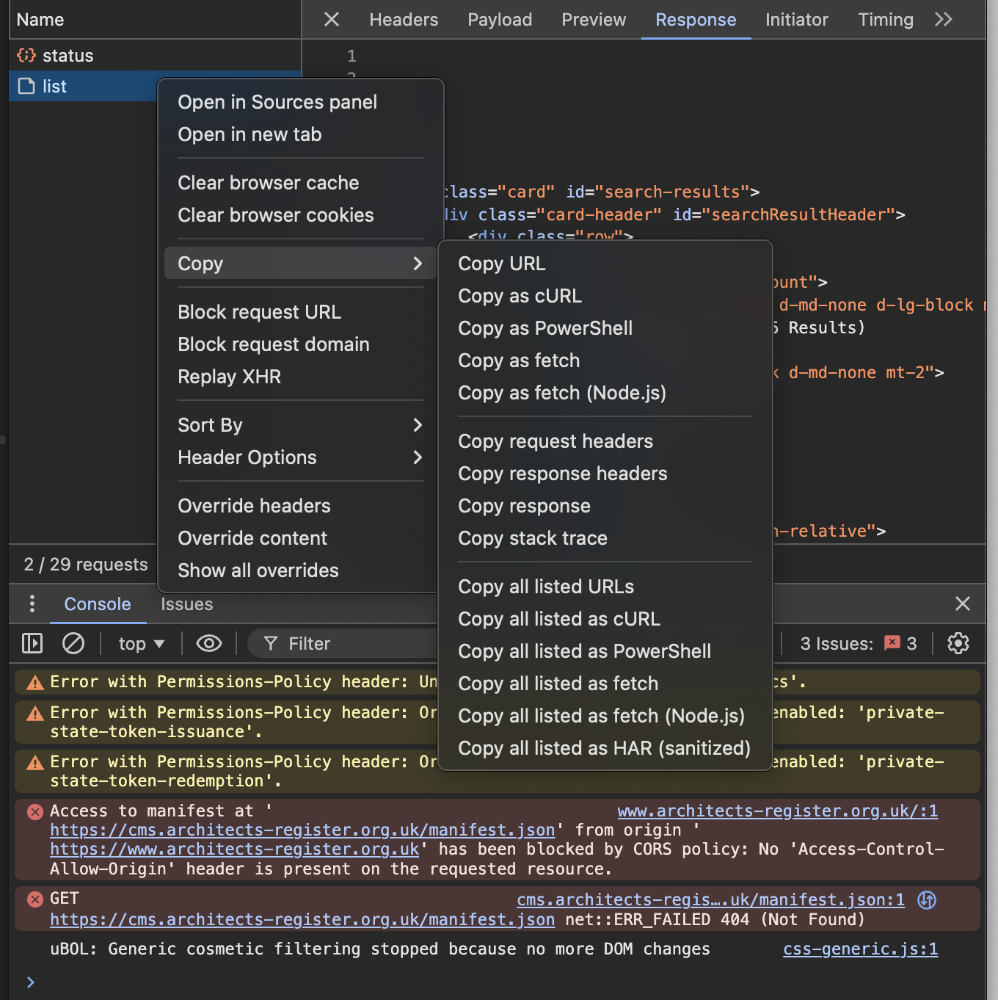

# Architects Register Scraper

An asynchronous web scraper built in Python for collecting architect data from the UK Architects Register website. The scraper efficiently collects information about registered architects including their names, registration numbers, companies, and addresses.

## Features

- ✨ Asynchronous data collection using `aiohttp`
- 📊 Real-time progress tracking with `tqdm`
- 🛡️ Built-in rate limiting to prevent server overload
- ⚙️ Configurable settings for country and request delays
- 💾 Structured JSON output with timestamp-based filenames

## Prerequisites

- Python 3.7 or higher
- pip (Python package installer)

## Installation

1. Clone this repository:
```bash
git clone <repository-url>
cd architects-register-scraper
```

2. Install required packages:
```bash
pip install -r requirements.txt
```

## Configuration

You can customize the scraper's behavior in `config/search_config.py`:

```python
# Change the country to search for
COUNTRY = "United Kingdom"

# Adjust delay between requests (in seconds)
DELAY = 0.2  # Default: 0.2 seconds

# Change the number of concurrent requests to the Architects Register
CONCURRENT_REQUESTS = 5
```

## Usage

Run the scraper with:
```bash
python scrape.py
```

The script will:
1. Connect to the Architects Register website
2. Calculate total pages to scrape
3. Display a progress bar during collection
4. Save results as JSON in the `output` directory

## Output Format

Data is saved in JSON format with the following structure:
```json
[
    {
        "name": "Architect Name",
        "registration_number": "123456",
        "company": "Architecture Firm Ltd",
        "address": "123 Building Street, City",
        "country": "United Kingdom",
        "profile_url": "https://www.architects-register.org.uk/..."
    },
    // ... more entries
]
```

Files are saved in the `output` directory with names like:
`architects_united_kingdom_20240315_123456.json`

## Project Structure
```
architects-register-scraper/
├── config/
│   ├── __init__.py
│   ├── request_config.py    # Request headers and payload configuration
│   └── search_config.py     # Search parameters
├── parsers/
│   └── architect_parser.py  # Main parsing logic
├── output/                  # Generated JSON files
├── requirements.txt         # Project dependencies
├── scrape.py               # Main script
└── README.md
```

## Error Handling

The scraper includes robust error handling:
- Failed requests are logged but don't halt the process
- Invalid entries are skipped with appropriate logging
- Network issues are caught and reported
- Session management ensures proper resource cleanup

## Rate Limiting Features

To ensure responsible scraping:
- Concurrent requests are limited (default: 5)
- Configurable delay between requests
- Single session reuse for optimal performance

## Performance

The scraper is highly efficient due to its asynchronous design:
- ⚡ Tested scraping 5,827 pages of UK architect data in under 10 minutes
- 🚀 Processes approximately 10 pages per second
- 💪 Maintains performance while respecting rate limits



## Updating Request Headers

### How to Update Headers to Match Your Browser

To update the request headers to match your browser configuration:

1. Visit the architects-register website
2. Perform an advanced search
3. Click on the "Next Page" button
4. Open Developer Tools (F12 or right-click > Inspect)
5. Go to the Network tab
6. Look for a request named "list"
7. Right-click on the request and select "Copy as cURL"
8. You can now:
   - Test the cURL command directly in your terminal
   - Extract the headers from the cURL command to update the `get_request_headers()` function

This method ensures your requests match your browser's exact configuration and helps with debugging.





**Tip**: The cURL command will contain all necessary headers, cookies, and authentication details needed for successful API requests.

## Contributing

Contributions are welcome! Please feel free to submit a Pull Request.